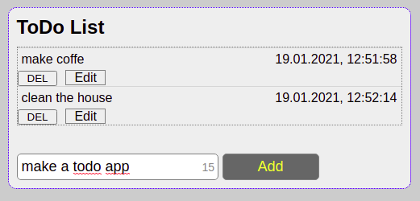
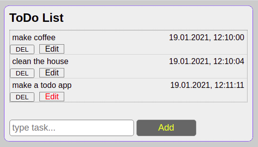
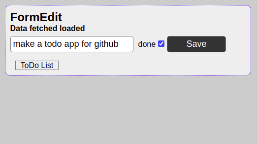
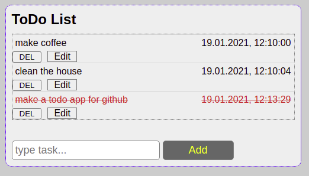
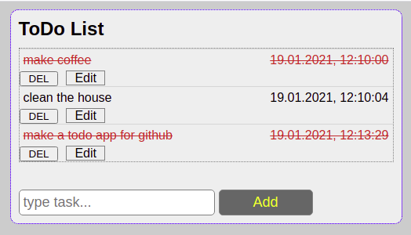
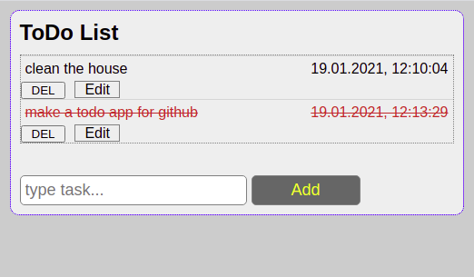

## react list-todo in REST API

#### About app
* add task to list & counting chars
* mark task done in style as line-through 
* styles in styled-components - props task done/not, hover, media-queries
* validate input - prevents you from typing empty input, using Ref
* get data from REST API & add task to REST & change property done in REST API
  - server REST API is needed
  - data in REST as example
  - [
        {
        "text": "Task 1 from REST API",
        "date": "17.01.2021, 17:11:33",
        "done": false,
        "id": 1
        }
    ]
* delete task
* routing for components
* edit task & validation

#### Some pictures od app

